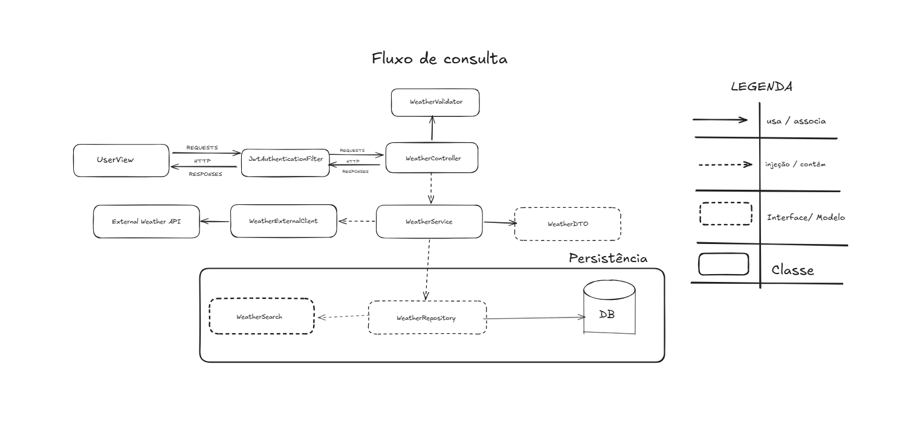
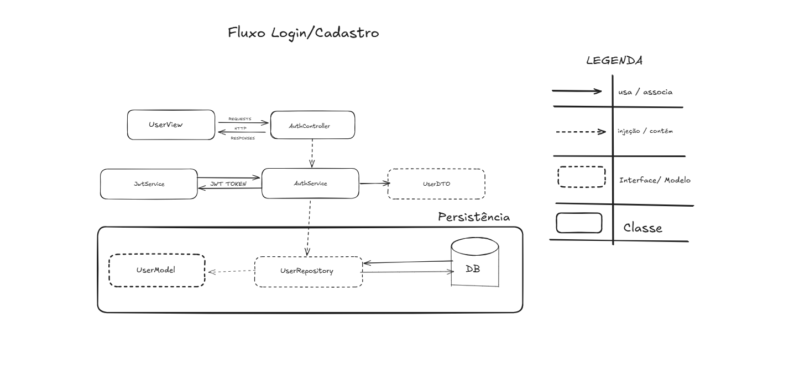

# WeatherHub
Projeto em execução de uma API REST desenvolvida com Spring Boot para consulta de dados climáticos em uma API externa, com autenticação de usuários e armazenamento do histórico de buscas.
Diagramas do projeto
## Fluxo de Consulta

## Fluxo de Cadastro e Login

## Funcionalidades previstas

- Consulta de dados climáticos por cidade através de integração com uma API externa
- Sistema de autenticação e login de usuários utilizando JWT
- Armazenamento do histórico de consultas realizadas pelos usuários
- Visualização do histórico de pesquisas por período de tempo

## Tecnologias utilizadas

- Java
- Spring Boot (Spring Web, Spring Security, Spring Data JPA)
- PostgreSQL
- Hibernate / JPA
- JWT para autenticação